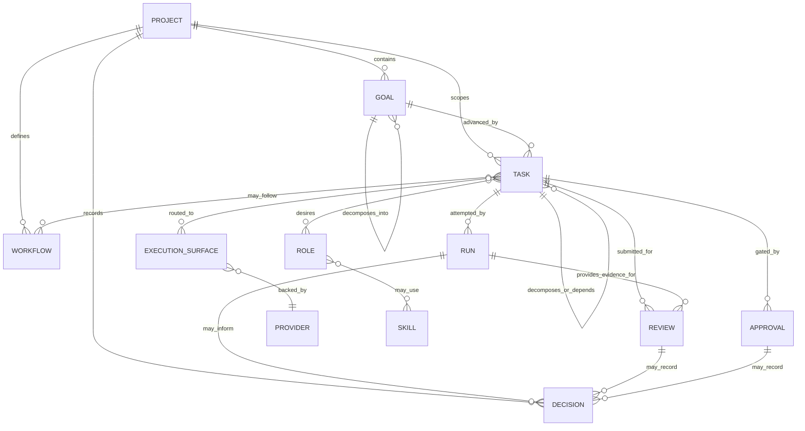

# AMS Model Diagram

Date: 2026-07-01
Status: Draft, conceptual

This diagram is a lightweight review aid. It should make overlaps and relationship questions visible; it is not a database schema.

Candidate or under-modeled concepts from `docs/domain-glossary.md` should be added only after a model change proposal accepts their representation.

