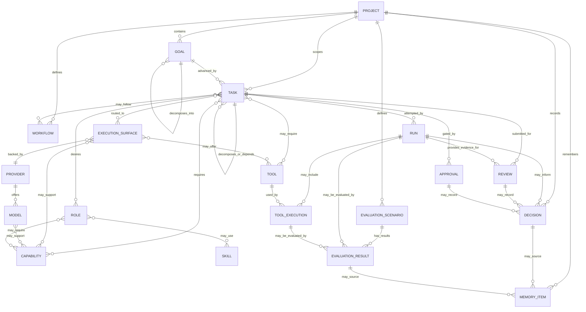

# AMS Model Diagram

Date: 2026-07-01
Status: Draft, conceptual

This diagram is a lightweight review aid. It should make overlaps and relationship questions visible; it is not a database schema.

```mermaid
erDiagram
    PROJECT ||--o{ GOAL : contains
    PROJECT ||--o{ TASK : scopes
    PROJECT ||--o{ WORKFLOW : defines
    PROJECT ||--o{ DECISION : records
    PROJECT ||--o{ MEMORY_ITEM : remembers

    GOAL ||--o{ GOAL : decomposes_into
    GOAL ||--o{ TASK : advanced_by

    TASK ||--o{ TASK : decomposes_or_depends
    TASK ||--o{ RUN : attempted_by
    TASK ||--o{ REVIEW : submitted_for
    TASK ||--o{ APPROVAL : gated_by
    TASK }o--o{ WORKFLOW : may_follow
    TASK }o--o{ ROLE : desires
    TASK }o--o{ EXECUTION_SURFACE : routed_to
    TASK }o--o{ TOOL : may_require
    TASK }o--o{ CAPABILITY : requires

    RUN ||--o{ REVIEW : provides_evidence_for
    RUN ||--o{ DECISION : may_inform
    RUN ||--o{ TOOL_EXECUTION : may_include
    REVIEW ||--o{ DECISION : may_record
    APPROVAL ||--o{ DECISION : may_record
    DECISION ||--o{ MEMORY_ITEM : may_source

    EXECUTION_SURFACE }o--|| PROVIDER : backed_by
    EXECUTION_SURFACE }o--o{ TOOL : may_offer
    EXECUTION_SURFACE }o--o{ CAPABILITY : may_support
    PROVIDER ||--o{ MODEL : offers
    MODEL }o--o{ CAPABILITY : may_support
    TOOL ||--o{ TOOL_EXECUTION : used_by
    ROLE }o--o{ SKILL : may_use
    ROLE }o--o{ CAPABILITY : may_require

    PROJECT ||--o{ EVALUATION_SCENARIO : defines
    EVALUATION_SCENARIO ||--o{ EVALUATION_RESULT : has_results
    RUN ||--o{ EVALUATION_RESULT : may_be_evaluated_by
    TOOL_EXECUTION ||--o{ EVALUATION_RESULT : may_be_evaluated_by
    EVALUATION_RESULT ||--o{ MEMORY_ITEM : may_source
```

Candidate or under-modeled concepts from `docs/domain-glossary.md` should be added only after a model change proposal accepts their representation.

Accepted note: `Capability` is an accepted minimal concept by `docs/model-decisions/2026-07-03-accept-minimal-capability-concept.md`. Current capability strings remain candidate/source labels until a later schema decision accepts production registry persistence, alias handling, hierarchy, and migration.

Accepted note: `Provider` is already an accepted implementation record. `Model` is an accepted minimal concept by `docs/model-decisions/2026-07-03-accept-minimal-model-concept.md`; current model names/pricing/run labels remain source data until a later schema decision accepts production model registry persistence, alias/version policy, and pricing refresh.

Accepted note: `Tool` is an accepted minimal concept by `docs/model-decisions/2026-07-03-accept-minimal-tool-concept.md`. `ToolExecution` is an accepted minimal evidence concept by `docs/model-decisions/2026-07-03-accept-minimal-tool-execution-concept.md`. Current `v2_preview_tool_executions` records remain preview storage until a later schema decision accepts production persistence.

Accepted note: `EvaluationScenario` is an accepted minimal concept by `docs/model-decisions/2026-07-03-accept-minimal-evaluation-scenario-concept.md`. `EvaluationResult` is an accepted minimal evidence concept by `docs/model-decisions/2026-07-03-accept-minimal-evaluation-result-concept.md`. Current `v2_preview_evaluation_results` records remain preview storage until a later schema decision accepts production persistence.

Preview note: `RoutingDecision` is preview-only by `docs/model-change-proposals/0003-preview-routing-decision.md`, and `docs/model-decisions/2026-07-03-do-not-accept-standalone-routing-decision-concept.md` decides not to accept it as a standalone production entity. Future production route choices should likely attach to accepted `Decision` records; reusable routing rules may later become a separate `RoutingPolicy`.

Preview note: `DependencyReductionRecord` remains experimental by `docs/model-change-proposals/0004-preview-dependency-reduction-record.md` and `docs/model-decisions/2026-07-03-keep-dependency-reduction-record-experimental.md`. It should not be added to the accepted diagram as a production entity until replacement state, evidence links, provider/model links, and capability semantics are split or accepted.

Accepted note: `MemoryItem` is an accepted minimal governed knowledge concept by `docs/model-decisions/2026-07-03-accept-minimal-memory-item-concept.md`. Current `v2_preview_memory_items` records remain preview storage until a later schema decision accepts production persistence and retrieval policy.

Preview note: `Review` and `Approval` are accepted concepts. `docs/model-change-proposals/0006-preview-review-approval-recording.md` governs preview write behavior over existing `v2_reviews` and `v2_approvals`; it does not add new production entities.
